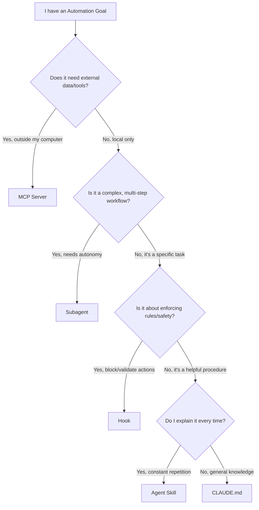

# The Tool Selection Guide: The Hierarchy of Automation

You’ve learned the parts. You know how to build a Skill, configure a Subagent, and connect an MCP server.

But the most common question from founders and developers isn’t *"How do I build X?"*—it’s *"WHAT should I build?"*

> *"I want to automate my code reviews. Is that a Skill? Or a Subagent?"*
> *"I need to search my database. Do I need an MCP server, or can a Skill do that?"*

This guide is your compass. We’ll cut through the complexity with a simple decision framework.

---

## The 5-Second Decision Guide

If you stop reading here, memorize this table. It solves 90% of architectural debates.

| If you need... | Then use... | The "Digital FTE" Analogy |
| :--- | :--- | :--- |
| **Persistent Context** | **CLAUDE.md** | The Employee Handbook |
| **Repeated Procedures** | **Skill** | A Standard Operating Procedure (SOP) |
| **Delegation & Focus** | **Subagent** | A Specialized Department / Team |
| **External Systems/Data** | **MCP** | IT Access / Permitted Software |
| **Quality Gates/Safety** | **Hooks** | Compliance & Security Officers |

---

## The Decision Tree visualization

When you face a new automation challenge, follow this logic flow:

---

## The "Digital FTE" Mental Model

To truly design "Digital Employees," stop thinking like a developer (functions, scripts) and start thinking like a Manager (roles, responsibilities).

### 1. CLAUDE.md = The Employee Handbook 📘
Every new hire gets a handbook. It tells them: *"Here is our mission. Here is how we prefer things formatted. Here is who to ask for help."*
*   **Use when:** You want to set the baseline culture and context for *every* interaction.
*   **Don't use for:** Specific, granular tasks (too much noise).

### 2. Skills = Standard Operating Procedures (SOPs) 📋
When you hire an accountant, you give them a checklist: *"Project Setup Checklist."* *"End-of-Month Protocol."*
*   **Use when:** You have a repeatable task (writing a test, formatting a blog post) that you want done *your way*.
*   **Don't use for:** Massive, ambiguous projects requiring 2 hours of autonomy.

### 3. Subagents = Specialized Departments 🏢
You don't ask the "General Receptionist" to audit your taxes. You send that to the "Accounting Department."
*   **Use when:** The task requires a different *mindset* or set of tools. (e.g., A "Testing Subagent" needs different prompts than a "Creative Writing Subagent").
*   **Don't use for:** Simple tasks. Creating a whole department to "fix a typo" is bureaucracy.

### 4. MCP = IT Access & Software 🔌
An employee can’t check Salesforce if you don’t give them a login. MCP is that login.
*   **Use when:** The intelligence is locked away in a database, API, or website.
*   **Don't use for:** Things the model already knows (e.g., Python syntax).

### 5. Hooks = Compliance & Security 👮
The Compliance Officer doesn't do the work; they typically *stop* work that is dangerous. *"Stop! You can't merge to main without approval."*
*   **Use when:** You need to enforce hard constraints or automate invisible logging.
*   **Don't use for:** Helpful suggestions. That's a Skill.

---

## Common Scenarios: What Would You Pick?

### Scenario A: "I want Claude to check our Jira board for new tickets."
*   **Analysis:** Does it need external data? Yes (Jira is a project management tool outside your computer).
*   **Selection:** **MCP**. You need a Jira MCP server.

### Scenario B: "Every time Claude writes code, I want it to follow our specific engaging naming convention (e.g., `unicorn_launcher`)."
*   **Analysis:** Is it a repeated procedure/preference? Yes.
*   **Selection:** **CLAUDE.md** (if global project rule) or **Skill** (if specific to one task type). Likely **CLAUDE.md**.

### Scenario C: "I want to give Claude a 'Research Mode' where it browses the web, summarizes 50 pages, and writes a report without distracting me."
*   **Analysis:** Is it complex? Yes. Does it need focused autonomy? Yes.
*   **Selection:** **Subagent**. Create a "Researcher" subagent equipped with Browser MCP.

### Scenario D: "Stop Claude from committing secrets/API keys to git."
*   **Analysis:** Is it safety/validation? Yes. (Preventing accidental leaks of passwords).
*   **Selection:** **Hook**. A `pre-git-commit` hook (a script that runs before saving changes).

---

## The Strategic Takeaway

**Amateurs build prompts.**
**Professionals build Systems.**

A "System" is simply the smart combination of these five elements. Your goal as an Agent Architect is to place the complexity in the right bucket.
